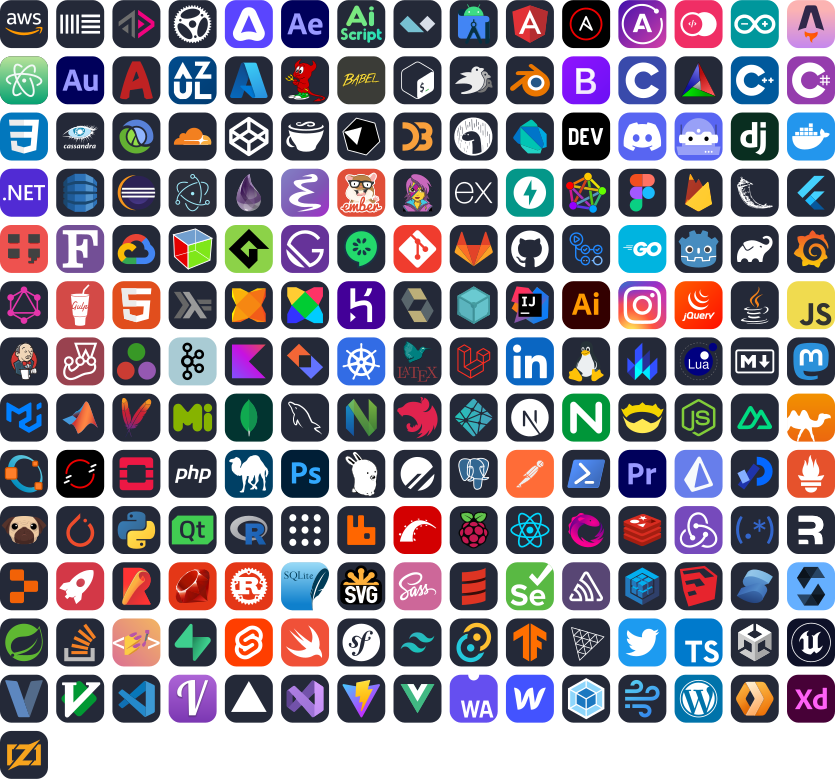

<h1 align='center'> Hi 👋, I'm Ali Elshorpagi </h1>

  
  
  
  

 

- I'm a <strong>CS Student</strong> 💻
- I’m currently learning <strong>ASP.Net</strong>
- I love playing <strong>Chess </strong>

##  Skills & Tools

 
  &emsp; 
   
  &emsp;
   
    &emsp;
   
    &emsp;
   
    &emsp;
  
  &emsp;
  
  &emsp;

##  Connect with me

  &emsp;&emsp;

  &emsp;&emsp;

 

  

	<picture>
		  <source media="(prefers-color-scheme: dark)" srcset="https://raw.githubusercontent.com/Ali-Elshorpagi/Ali-Elshorpagi/output/github-contribution-grid-snake-dark.svg">
		  <source media="(prefers-color-scheme: light)" srcset="https://raw.githubusercontent.com/Ali-Elshorpagi/Ali-Elshorpagi/output/github-contribution-grid-snake.svg">
		  
	</picture>

